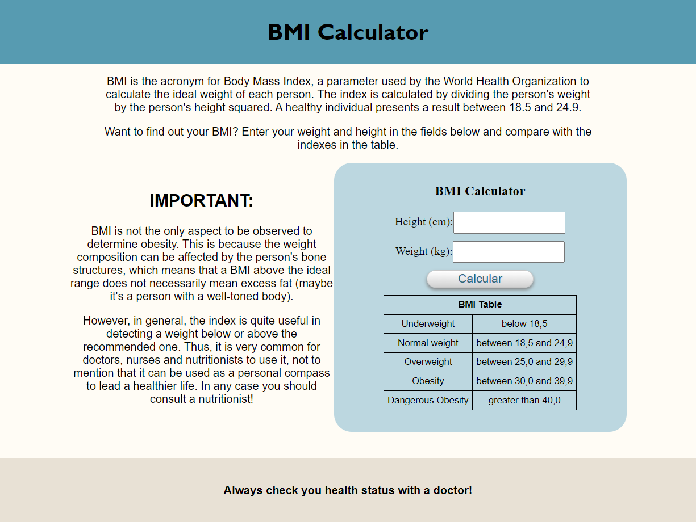

# BMI-Calculator
Repository for a BMI Calculator made with HTML, CSS and JavaScript!

The project is part of the "Front End Developer - HTML CSS Bootstrap JavaScript React" course avilable in Udemy!

[Link para acessar](https://geraldopmj.github.io/BMI-Calculator/)

# Technology used:

- HTML
- CSS
- JavaScript
- Git e Github

## Contact:

geraldo.pmj@gmail.com

## Preview:

